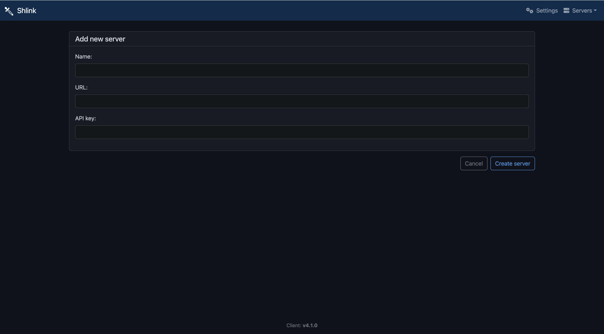

# 起動の仕方
```bash
docker compose up -d
```

# apikeyの取得の仕方
```bash
docker exec -it my_shlink shlink api-key:generate
```

# アクセスの仕方
まず、APIKeyを作成する
その後 https://app.shlink.io/ にアクセスをして、セットアップを行う



以下のように設定を行う
- name
  - 自由
- URL
  - https://url.sysken.net
- api
  - 作成したAPIKey


